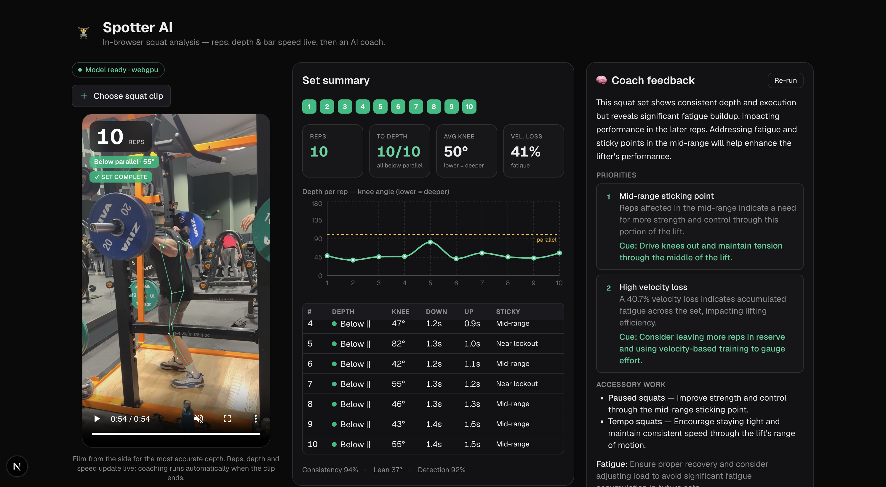

# Spotter AI

In-browser squat form analysis with **YOLO26-pose** + an **OpenAI strength coach**.



Upload a clip of a squat set (side view is best). A YOLO26-pose model runs
entirely in your browser (ONNX Runtime Web / WebGPU) to track 17 body keypoints
per frame. From those keypoints the app tracks the hips as the motion signal and,
per set, reports:

- **Reps** — counted live during playback, then confirmed by a precise
  post-playback pass.
- **Depth** — interior **knee angle** (hip–knee–ankle) plus a **hips-below-knees**
  check → each rep classified above / at / below parallel.
- **Speed** — descent/drive **tempo**, mean & peak concentric velocity, and
  set-wide **velocity loss** (fatigue).
- **More** — forward torso lean, sticky point (out of the hole / mid / lockout),
  depth consistency, and left/right symmetry.

When the clip finishes, a structured summary is sent to the OpenAI API with a
squat-coach prompt and feedback is generated **automatically** (no button). Set
history and progress charts are stored locally in IndexedDB.

The video never leaves your device — only the numeric set summary is sent to the
coach endpoint.

A person-consistency gate drops frames where the lifter is briefly hidden behind
the plates at the bottom (or a bystander is picked up) and bridges them, so
occlusion doesn't corrupt the rep count or the depth read.

## Setup

1. **Node** (LTS) and **npm**. Install deps:
   ```bash
   npm install
   ```
2. **Pose model** — export once (see [`scripts/export_model.md`](scripts/export_model.md)):
   ```bash
   conda create -n benchpress -c conda-forge python=3.11 pip -y
   conda activate benchpress
   pip install ultralytics onnx
   yolo export model=yolo26n-pose.pt format=onnx opset=13
   mkdir -p public/models && mv yolo26n-pose.onnx public/models/
   ```
3. **OpenAI key** — the only env var. In `.env.local`:
   ```
   OPENAI_API_KEY=sk-...
   ```

## Run

```bash
npm run dev     # http://localhost:3000
```

Upload a clip and press play; analysis and coaching run when the clip ends. Open
**History** for progress dashboards.

## Scripts

| Command | What |
|---|---|
| `npm run dev` | Dev server |
| `npm run build` / `npm start` | Production build / serve |
| `npm test` | Unit tests (analysis engine + pose decode/smoothing) |
| `npm run typecheck` | `tsc --noEmit` |
| `npm run lint` | ESLint |

## Architecture

- **Pose (browser):** `src/lib/pose/*` + `src/workers/pose.worker.ts` — letterbox
  → ONNX Runtime Web (WebGPU, WASM fallback) → decode `[1,300,57]` → One-Euro
  smoothing. Runs in a Web Worker.
- **Analysis (pure TS, unit-tested):** `src/lib/analysis/*` — an exercise-agnostic
  core (`keypoints.ts`, `util.ts`, the rep FSM + tempo in `reps.ts`) plus the
  squat engine `src/lib/analysis/squat/*`: a hip-depth signal, depth (knee angle +
  hips-below-knees), tempo/velocity, torso lean, sticky point, fatigue →
  `SquatSetAnalysis`.
- **Coach:** `src/app/api/coach/route.ts` streams OpenAI Structured Outputs from a
  squat-coach prompt (`src/lib/coach/*`).
- **Offline validation:** `scripts/dump_pose.py` runs the same `yolo26n-pose.pt`
  over a clip and dumps per-frame keypoints to JSON; the analysis engine is then
  validated against that real data (see `*.realclip.test.ts`, skipped when the
  dump is absent).
- **UI:** `src/components/squat/*`, pages in `src/app/`. State in Zustand, charts
  in Recharts, history in IndexedDB (`src/lib/db/history.ts`).

## Notes

- Model: **`yolo26n-pose` only**, no fallback. YOLO26 pose is end-to-end /
  NMS-free, which keeps the browser post-processing simple.
- Camera: **side view** first — knee-angle depth is most accurate side-on; from
  other angles the hips-below-knees check is used and depth is labeled tentative.
- The live pose overlay requires a browser with WebGPU (falls back to WASM).
